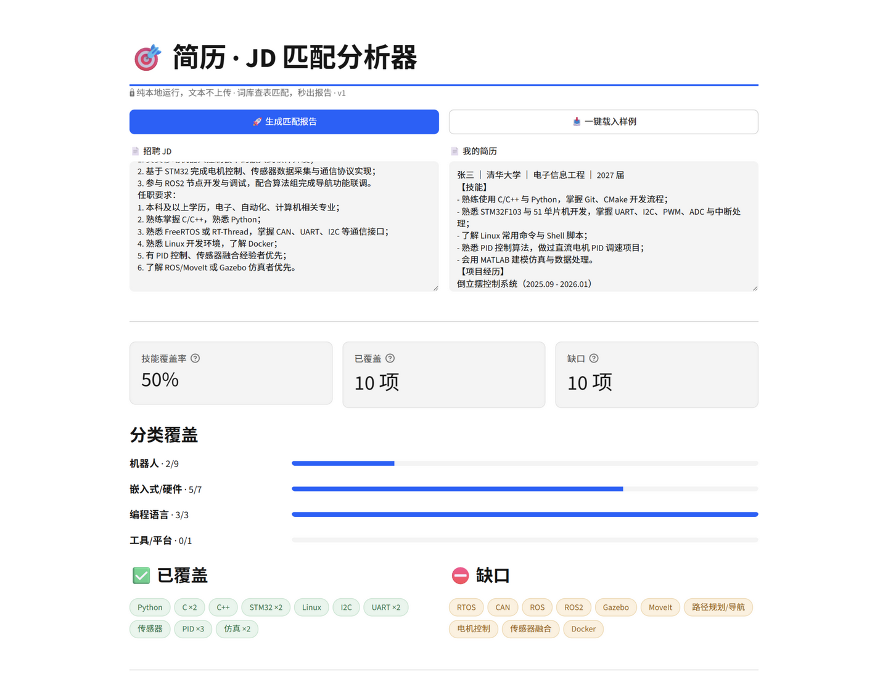

# 简历-JD 匹配分析器 (v1)

粘贴一段招聘 JD + 一份简历 → 秒出匹配报告：**技能覆盖率、已覆盖项、缺口清单、简历改写建议**。



## 解决什么问题

投简历时"我到底匹不匹配这个岗位"全凭感觉。本工具把这件事量化：从 JD 中提取技能要求，逐项到简历里找证据，算出覆盖率并给出缺口清单——哪些该写进去、哪些是真实差距。

## 功能与特点

- 技能覆盖率 + 分类进度条（编程语言 / 嵌入式硬件 / 机器人 / AI 算法 / 工具）
- 已覆盖 / 缺口双栏清单，精确到"哪个词在简历里命中了几次"
- 改写建议**渐进式**：词频建议秒出，永不干等；本机 LM Studio 在线时 AI 建议**流式逐字**追加
- **纯本地运行**：文本不上传任何服务器；LLM 建议也只调用本机 LM Studio
- 匹配引擎**零第三方依赖**（纯 Python 标准库），可独立测试

## 架构 / 模块分工

| 文件 | 职责 |
|---|---|
| `matcher.py` | 匹配引擎：词库查表 → JD 技能提取 → 覆盖率/缺口统计 |
| `skills_lexicon.json` | 技能词库（85 词条，含别名/分类），**加词不用改代码** |
| `app.py` | Streamlit 界面 |
| `llm_advisor.py` | 改写建议：词频建议秒出 + LM Studio 流式生成；任何失败自动降级 |
| `demo.py` | 命令行演示（不装 Streamlit 也能看效果） |
| `test_matcher.py` / `test_llm_advisor.py` | 引擎与建议模块的测试（`python test_*.py` 或 `pytest` 均可） |

**设计取舍**：技能提取用"词库查表"而非大模型——同一段输入永远得到同一份报告（可复现）、每个判定都能指出命中位置（可解释）、毫秒级零成本。LLM 只负责它擅长的"写人话建议"。

## 本地复现（3 步）

```bash
git clone https://github.com/Hazel-LCX/resume-jd-matcher.git
cd resume-jd-matcher
pip install -r requirements.txt
```

国内网络建议加清华镜像：`pip install -r requirements.txt -i https://pypi.tuna.tsinghua.edu.cn/simple`

```bash
streamlit run app.py
```

浏览器自动打开 `http://localhost:8501` → 点 **📥 一键载入样例** → 点 **🚀 生成匹配报告**。

要求 Python 3.10+。改写建议功能需要本机 [LM Studio](https://lmstudio.ai/) 加载模型并开启 API 服务（默认 `http://127.0.0.1:1234`）；**未开启时自动降级为纯词频建议模式，不影响其余功能**；在线时 AI 建议流式逐字输出（速度取决于硬件，核显约 9 字/秒）。若模型是思考型（Reasoning，如 Qwen3.5）：界面先显示思考进度、正文随后流出；若提示"思考耗尽预算"，请到 LM Studio 模型设置关闭 Thinking 后重试。

## 已知边界（v1 有意不做）

- 不做 PDF/图片解析（只接受粘贴文本）、无用户系统、不部署上线
- 词库查表不理解语义：简历写"直流电机 PID 调速"不会点亮"电机控制"（样例数据中可见此漏报）
- 词库之外的技能无法识别——扩展方式：编辑 `skills_lexicon.json`，引擎无需改动
