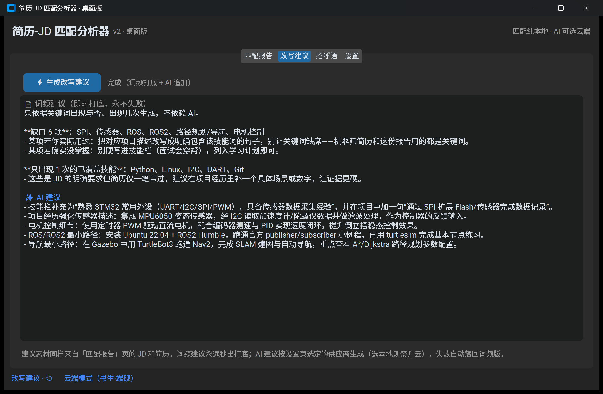
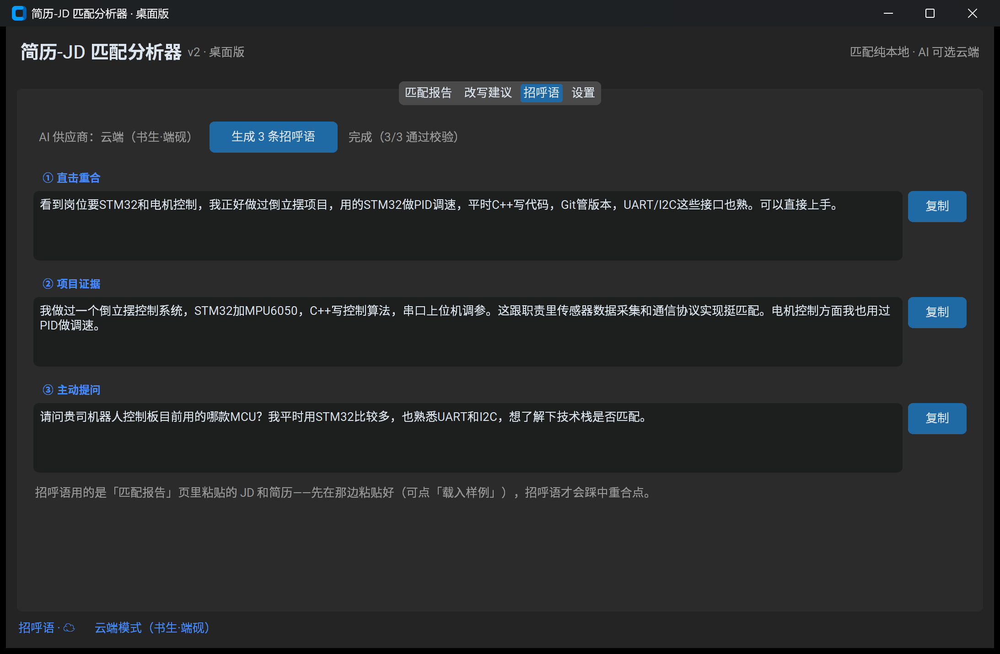

# 简历-JD 匹配分析器 (v2)

粘贴一段招聘 JD + 一份简历 → 秒出匹配报告：**技能覆盖率、已覆盖项、缺口清单、简历改写建议**；v2 新增 **AI 招呼语生成器**——沟通前一句话，自动踩中你和岗位的重合点。


## 解决什么问题

投简历时"我到底匹不匹配这个岗位"全凭感觉。本工具把这件事量化：从 JD 中提取技能要求，逐项到简历里找证据，算出覆盖率并给出缺口清单——哪些该写进去、哪些是真实差距。v2 再往前一步：报告看完要开口沟通时，自动生成踩中重合点的打招呼私信，不像群发。

## 两个入口

| 入口 | 启动 | 功能范围 |
|---|---|---|
| **桌面版（v2 主线）** | `python gui.py` | 匹配报告（含分类覆盖率）+ 改写建议 + AI 招呼语 + 设置页（BYOK） |
| **网页版（v1，功能冻结）** | `streamlit run app.py` | 匹配报告 + AI 改写建议 |

两个入口共享同一套引擎（matcher / providers / advisor / greeter）；桌面版是网页版的完全上位替代，网页版保持 v1 形态仅作存档。

桌面版「改写建议」页——词频建议秒出打底，AI 建议流式追加，失败自动降级：



桌面版「招呼语」页——三条风格各异、全部踩中重合点，逐条一键复制：



## 功能与特点

- 技能覆盖率 + 分类覆盖率进度条（编程语言 / 嵌入式硬件 / 机器人 / AI 算法 / 工具）
- 已覆盖 / 缺口清单，精确到"哪个词在简历里命中了几次"
- **改写建议**：词频建议秒出打底，AI 建议流式追加；任何失败自动降级，词频版永不缺席
- **AI 招呼语（v2）**：一次生成 3 条不同风格（直击重合 / 项目证据 / 主动提问），素材全部来自真实匹配报告；产物经引擎二次校验——**编造的技能、夸大词、AI 腔直接剔除**
- 改写建议**渐进式**（网页版）：词频建议秒出，永不干等；本机 LM Studio 在线时 AI 建议**流式逐字**追加
- **多供应商**：本地 LM Studio / 书生·端砚 / DeepSeek / 任意 OpenAI 兼容端点，界面里贴 key 即用
- **隐私分层**（详见下方"隐私设计"）：匹配永远纯本地；AI 是否连云端由你决定，界面徽章实时明示当前模式
- 匹配引擎**零第三方依赖**（纯 Python 标准库），可独立测试

## 架构 / 模块分工

| 文件 | 职责 |
|---|---|
| `matcher.py` | 匹配引擎：词库查表 → JD 技能提取 → 覆盖率/缺口统计 |
| `skills_lexicon.json` | 技能词库（94 词条，含别名/分类），**加词不用改代码** |
| `providers.py` | 供应商抽象层：配置卡片、回退链（跟随选择，**选本地禁升云**）、OpenAI 兼容流式协议、设置持久化 |
| `greeter.py` | 招呼语生成：四禁令 Prompt（禁编造/禁夸大/禁AI腔/禁谄媚）+ 引擎二次校验 + 词频模板保底 |
| `advisor.py` | 改写建议：词频建议秒出打底 + AI 建议经供应商链流式生成，失败自动降级（双保险） |
| `gui.py` | 桌面界面（CustomTkinter）：报告 / 招呼语 / 设置三页，LLM 调用在后台线程 |
| `app.py` | Streamlit 网页界面（v1，功能冻结） |
| `llm_advisor.py` | （网页版）改写建议：词频秒出 + LM Studio 流式生成，失败自动降级 |
| `demo.py` | 命令行演示（不装任何界面库也能看效果） |
| `test_*.py` | 引擎、建议、供应商、招呼语共 46 个测试（`pytest` 一键全跑） |

**设计取舍**：技能提取用"词库查表"而非大模型——同一段输入永远得到同一份报告（可复现）、每个判定都能指出命中位置（可解释）、毫秒级零成本。LLM 只负责它擅长的"写人话"；招呼语的"判断权"（哪些技能能写）同样在引擎手里。

## 隐私设计

- **匹配引擎**：纯本地毫秒级计算，文本永远不出本机（两个入口皆然）
- **AI 招呼语**：默认走本地 LM Studio；切换云端后，JD 与简历节选会发送到对应云 API——界面徽章实时明示当前模式（`☁️ 云端` / `🔒 本地` / `⚠️ 已降级` / `📄 词频保底`）
- **选本地 = 禁升云**：选择本地后，回退链里根本没有云端——隐私选择不会被降级路径悄悄破坏
- **key 存放**：只存本机用户目录（`%APPDATA%\resume-jd-matcher\settings.json`）或环境变量，绝不进代码与仓库

## 本地复现

```bash
git clone https://github.com/Hazel-LCX/resume-jd-matcher.git
cd resume-jd-matcher
pip install -r requirements.txt
```

国内网络建议加清华镜像：`pip install -r requirements.txt -i https://pypi.tuna.tsinghua.edu.cn/simple`

**桌面版（v2 主线）**：

```bash
python gui.py
```

- 词频匹配**零配置开箱即用**；AI 功能（招呼语 / 改写建议）需要"大脑"，两种配法任选：
  1. 界面「设置」页：选预设 → 贴 API Key → 测试连接 → 保存（key 只存本机用户目录）；
  2. 环境变量 `INTERNAI_API_KEY` / `DEEPSEEK_API_KEY`，程序自动读取；
  3. 本机装了 [LM Studio](https://lmstudio.ai/) 并开启服务（`http://127.0.0.1:1234`）也行，连 key 都不用。

**网页版（v1）**：

```bash
streamlit run app.py
```

浏览器自动打开 `http://localhost:8501` → 点 **📥 一键载入样例** → 点 **🚀 生成匹配报告**。改写建议功能需要本机 LM Studio 开启 API 服务，未开启时自动降级为纯词频建议。

要求 Python 3.10+。思考型模型（如 Qwen3.5）会先显示思考进度再流出正文；若提示"思考耗尽预算"，请到对应平台的模型设置里调整后重试。

## 测试与评估

```bash
pytest                             # 全部 39 个测试
python test_matcher.py             # 仅匹配引擎
python eval.py <文本> <标注文件>    # 真实数据评估：引擎提取 vs 人工标注
```

`eval.py` 用于真实数据回归：找一段真实 JD，通读后把"你认为岗位要求的技能"逐行写进标注文件，跑脚本对比召回率与漏报——漏报清单直接指引词库迭代。示例标注见 `real_data/`。

## 打包成 exe（可选）

不想让别人装 Python 也可以打成单文件 exe：

```bash
pip install pyinstaller
python -m PyInstaller --noconfirm --clean --onefile --windowed ^
  --collect-all customtkinter --add-data "skills_lexicon.json;." ^
  --name resume-jd-matcher gui.py
```

产物在 `dist/resume-jd-matcher.exe`（约 172 MB，首次启动需解压、稍慢）。两个易踩的坑已写进命令：`--collect-all customtkinter` 负责主题资源文件，`--add-data` 负责技能词库——漏了后者，程序启动即崩（引擎用 `__file__` 同目录找词库，onefile 模式下它不会自动进包）。

## 已知边界（有意不做）

- 不做 PDF/图片解析（只接受粘贴文本）、无用户系统、不部署上线
- 词库查表不理解语义：简历写"直流电机 PID 调速"不会点亮"电机控制"（样例数据中可见此漏报）
- 词库之外的技能无法识别——扩展方式：编辑 `skills_lexicon.json`，引擎无需改动
- 招呼语策略是"只打重合点"：转述 JD 里的缺口技能会被二次校验剔除，这是特性不是缺陷
